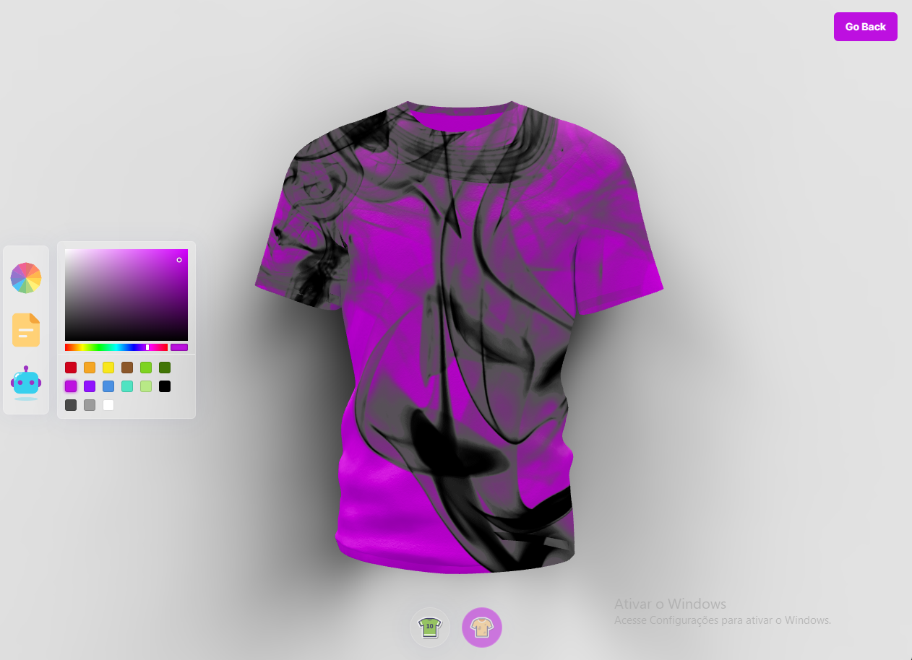

<h1 align="center"> Website Using React | 2023 Three JS and OpenAI </h1>

  <a href="#-tecnologias">Tecnologias</a>&nbsp;&nbsp;&nbsp;|&nbsp;&nbsp;&nbsp;
  <a href="#-projeto">Projeto</a>&nbsp;&nbsp;&nbsp;|&nbsp;&nbsp;&nbsp;
  <a href="#memo-licença">Licença</a>

  

 

  

## 🚀 Tecnologias

Esse projeto foi desenvolvido com as seguintes tecnologias:

- ThreeJS
- React Three Fiber
- TailwindCSS
- Framer Motion

## 💻 Projeto

Muitas grandes corporações já usam gráficos 3D para mostrar seus produtos. Site de produto ThreeJS 3D e com o poder da inteligência artificial!

## 📝 Licença

Esse projeto está sob a licença MIT.

---

Feito com ♥ by Marcelo Claro Lopes - Web Developer
